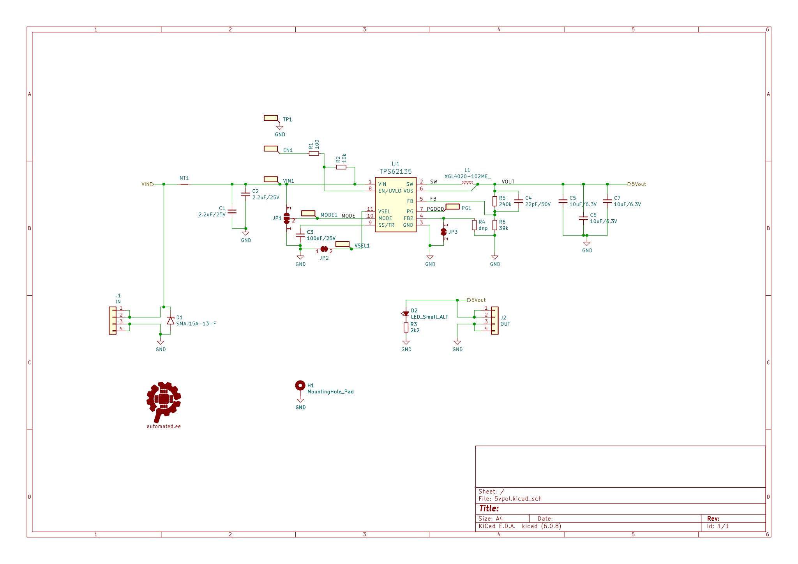
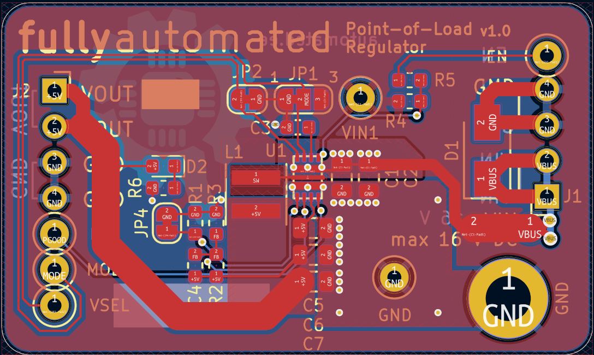

# Test Report

The module contains a [TPS62135](https://www.ti.com/lit/ds/symlink/tps62135.pdf) and was tested with a HMP4040 power supply and a Korad KEL-103 electronic load. A Siglent SDM3065X was used to calibrate the instruments and to measure the output voltage and a Brymen BM869s was used for the output current measurement.

This report is (for now) just a basic example of what can be done and how a test report for a module could look like.

## Schematic

## PCB

## Test procedure

`Add a picture of the test setup here`

## Test results

As the test was not completed yet, there's nothing to report at this point.
