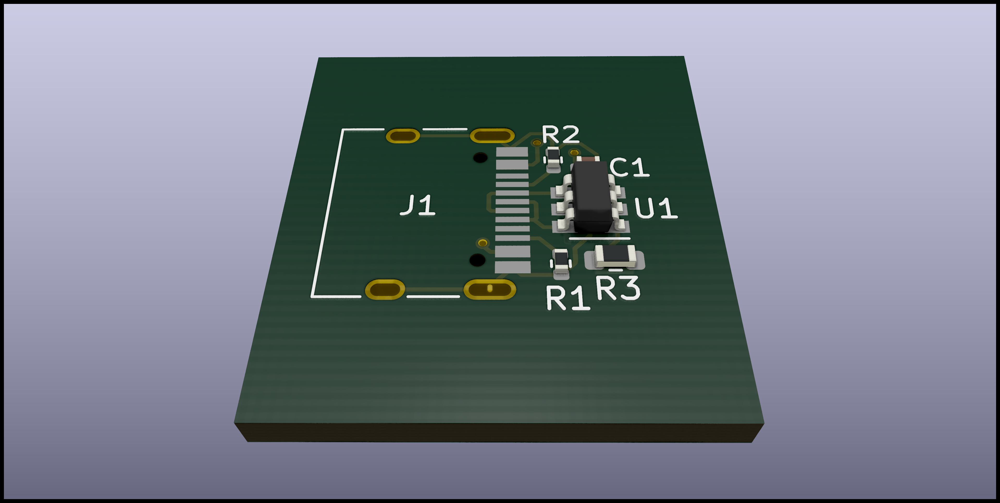

# USB-C Connector

This module provides a simple, USB-C receptacle including necessary protections and passives.
It is configured as a Sink/Device.

The 1.5k resistor should not be populated, except if the downstream (e.g. MCU) does not have a built-in one.

## JLC Compatible

Both the connector and the ESD-protection diode are extended parts, the rest of the passives
are basic parts.
